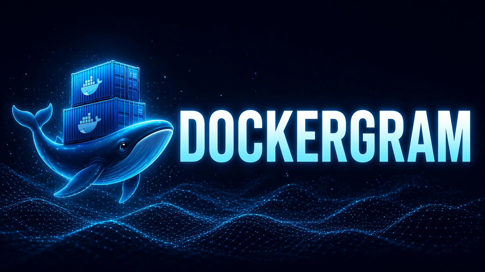

Real-time Docker container visualizer.

Includes:
- Container status (RUN/OFF)
- CPU, memory, and network usage
- Start/Restart/Stop/Kill controls

## Structure

- `backend/`: API + WebSocket + Docker integration
- `frontend/`: React UI + 3D scene

## Requirements

- Docker Desktop (or an active Docker daemon)
- Go 1.26+
- Node.js 20+

## Run Backend

PowerShell (exactly as tested):

```powershell
Set-Location backend
$env:DOCKERGRAM_ACTION_TOKEN = "dockergram-dev"
Write-Output "DOCKERGRAM_ACTION_TOKEN=$env:DOCKERGRAM_ACTION_TOKEN"
go run .
```

Equivalent CMD:

```cmd
cd backend
set DOCKERGRAM_ACTION_TOKEN=dockergram-dev
echo DOCKERGRAM_ACTION_TOKEN=%DOCKERGRAM_ACTION_TOKEN%
go run .
```

If `DOCKERGRAM_ACTION_TOKEN` is not configured, Start/Restart/Stop/Kill actions are disabled.

Optional hardening flag:
- `DOCKERGRAM_TRUST_PROXY_HEADERS=true` only when backend is behind a trusted reverse proxy and you need `X-Forwarded-For` / `X-Real-IP` for rate limiting.

## Run Frontend

PowerShell (exactly as tested):

```powershell
Set-Location frontend
npm install
$env:VITE_ACTION_TOKEN = "dockergram-dev"
Write-Output "VITE_ACTION_TOKEN=$env:VITE_ACTION_TOKEN"
npm run dev
```

Equivalent CMD:

```cmd
cd frontend
npm install
set VITE_ACTION_TOKEN=dockergram-dev
echo VITE_ACTION_TOKEN=%VITE_ACTION_TOKEN%
npm run dev
```

Optionally, you can configure `VITE_BACKEND_HTTP_ORIGIN` to target a different backend.

Frontend: `http://localhost:5173`
Backend: `http://127.0.0.1:8080`
